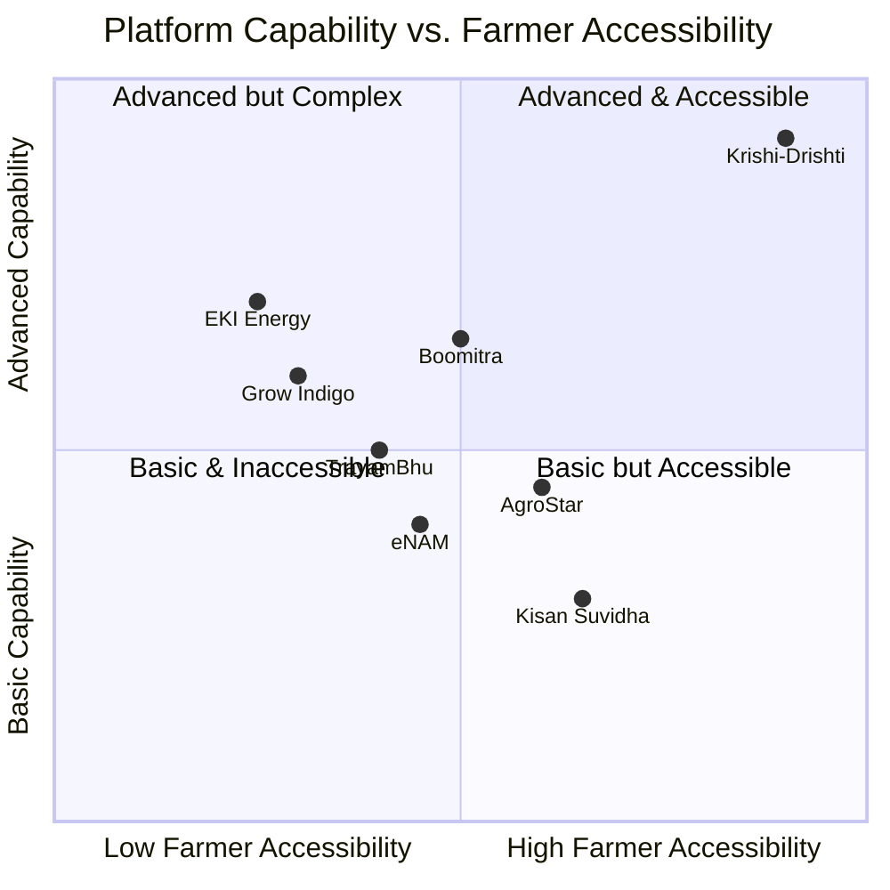

# Competitive Analysis Diagram
# Krishi-Drishti vs Existing Platforms
# Used in: Section 2.1 of PROJECT_REPORT_FINAL.txt
# Render at: https://mermaid.live

```mermaid
quadrantChart
    title Platform Capability vs. Farmer Accessibility
    x-axis Low Farmer Accessibility --> High Farmer Accessibility
    y-axis Basic Capability --> Advanced Capability

    quadrant-1 "Advanced & Accessible"
    quadrant-2 "Advanced but Complex"
    quadrant-3 "Basic & Inaccessible"
    quadrant-4 "Basic but Accessible"

    Krishi-Drishti: [0.90, 0.92]
    Boomitra: [0.50, 0.65]
    eNAM: [0.45, 0.40]
    EKI Energy: [0.25, 0.70]
    Grow Indigo: [0.30, 0.60]
    AgroStar: [0.60, 0.45]
    Kisan Suvidha: [0.65, 0.30]
    TrayamBhu: [0.40, 0.50]
```
