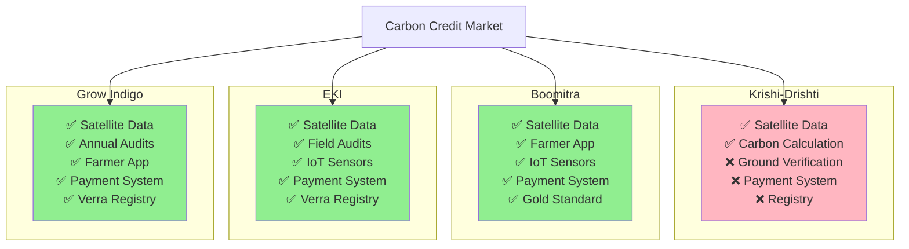

```mermaid
graph TB
    subgraph Krishi-Drishti
        KD1["✅ Satellite Data<br/>✅ Carbon Calculation<br/>❌ Ground Verification<br/>❌ Payment System<br/>❌ Registry"]
    end
    
    subgraph Boomitra
        BM1["✅ Satellite Data<br/>✅ Farmer App<br/>✅ IoT Sensors<br/>✅ Payment System<br/>✅ Gold Standard"]
    end
    
    subgraph EKI
        EKI1["✅ Satellite Data<br/>✅ Field Audits<br/>✅ IoT Sensors<br/>✅ Payment System<br/>✅ Verra Registry"]
    end
    
    subgraph Grow Indigo
        GI1["✅ Satellite Data<br/>✅ Annual Audits<br/>✅ Farmer App<br/>✅ Payment System<br/>✅ Verra Registry"]
    end
    
    A["Carbon Credit Market"] --> KD1
    A --> BM1
    A --> EKI1
    A --> GI1
    
    style KD1 fill:#FFB6C1
    style BM1 fill:#90EE90
    style EKI1 fill:#90EE90
    style GI1 fill:#90EE90
```
