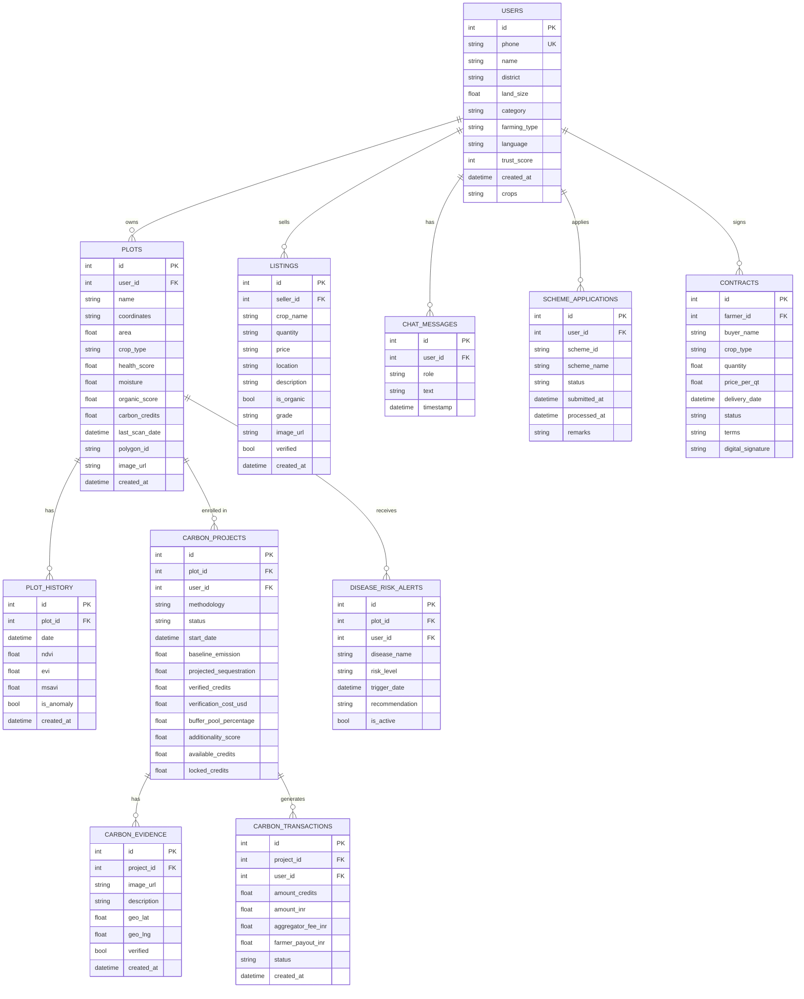

# Database Entity Relationship Diagram
# Krishi-Drishti - Complete Database Schema (ER Diagram)
# Used in: Section 4.1.1 Layer 4 of PROJECT_REPORT_FINAL.txt
# Render at: https://mermaid.live

```mermaid
erDiagram
    USERS {
        int id PK
        string phone UK
        string name
        string district
        float land_size
        string category
        string farming_type
        string language
        int trust_score
        datetime created_at
        string crops
    }

    PLOTS {
        int id PK
        int user_id FK
        string name
        string coordinates
        float area
        string crop_type
        float health_score
        float moisture
        float organic_score
        float carbon_credits
        datetime last_scan_date
        string polygon_id
        string image_url
        datetime created_at
    }

    PLOT_HISTORY {
        int id PK
        int plot_id FK
        datetime date
        float ndvi
        float evi
        float msavi
        bool is_anomaly
        datetime created_at
    }

    CARBON_PROJECTS {
        int id PK
        int plot_id FK
        int user_id FK
        string methodology
        string status
        datetime start_date
        float baseline_emission
        float projected_sequestration
        float verified_credits
        float verification_cost_usd
        float buffer_pool_percentage
        float additionality_score
        float available_credits
        float locked_credits
    }

    CARBON_EVIDENCE {
        int id PK
        int project_id FK
        string image_url
        string description
        float geo_lat
        float geo_lng
        bool verified
        datetime created_at
    }

    CARBON_TRANSACTIONS {
        int id PK
        int project_id FK
        int user_id FK
        float amount_credits
        float amount_inr
        float aggregator_fee_inr
        float farmer_payout_inr
        string status
        datetime created_at
    }

    LISTINGS {
        int id PK
        int seller_id FK
        string crop_name
        string quantity
        string price
        string location
        string description
        bool is_organic
        string grade
        string image_url
        bool verified
        datetime created_at
    }

    CHAT_MESSAGES {
        int id PK
        int user_id FK
        string role
        string text
        datetime timestamp
    }

    SCHEME_APPLICATIONS {
        int id PK
        int user_id FK
        string scheme_id
        string scheme_name
        string status
        datetime submitted_at
        datetime processed_at
        string remarks
    }

    DISEASE_RISK_ALERTS {
        int id PK
        int plot_id FK
        int user_id FK
        string disease_name
        string risk_level
        datetime trigger_date
        string recommendation
        bool is_active
    }

    CONTRACTS {
        int id PK
        int farmer_id FK
        string buyer_name
        string crop_type
        float quantity
        float price_per_qt
        datetime delivery_date
        string status
        string terms
        string digital_signature
    }

    USERS ||--o{ PLOTS : "owns"
    USERS ||--o{ LISTINGS : "sells"
    USERS ||--o{ CHAT_MESSAGES : "has"
    USERS ||--o{ SCHEME_APPLICATIONS : "applies"
    USERS ||--o{ CONTRACTS : "signs"
    PLOTS ||--o{ PLOT_HISTORY : "has"
    PLOTS ||--o{ CARBON_PROJECTS : "enrolled in"
    PLOTS ||--o{ DISEASE_RISK_ALERTS : "receives"
    CARBON_PROJECTS ||--o{ CARBON_EVIDENCE : "has"
    CARBON_PROJECTS ||--o{ CARBON_TRANSACTIONS : "generates"
```
