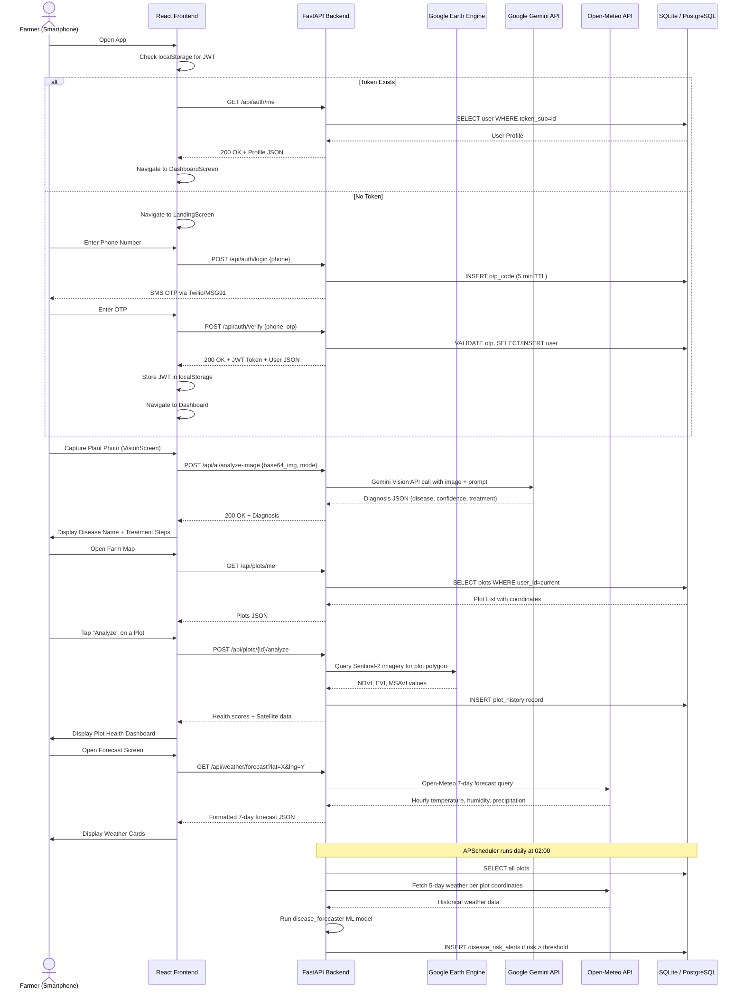

# Farmer Application Workflow
# Krishi-Drishti - Complete User Journey (Sequence Diagram)
# Used in: Section 4.1.2 of PROJECT_REPORT_FINAL.txt
# Render at: https://mermaid.live

```mermaid
sequenceDiagram
    actor F as Farmer (Smartphone)
    participant FE as React Frontend
    participant BE as FastAPI Backend
    participant GE as Google Earth Engine
    participant GM as Google Gemini API
    participant WX as Open-Meteo API
    participant DB as SQLite / PostgreSQL

    F->>FE: Open App
    FE->>FE: Check localStorage for JWT
    alt Token Exists
        FE->>BE: GET /api/auth/me
        BE->>DB: SELECT user WHERE token_sub=id
        DB-->>BE: User Profile
        BE-->>FE: 200 OK + Profile JSON
        FE->>FE: Navigate to DashboardScreen
    else No Token
        FE->>FE: Navigate to LandingScreen
        F->>FE: Enter Phone Number
        FE->>BE: POST /api/auth/login {phone}
        BE->>DB: INSERT otp_code (5 min TTL)
        BE-->>F: SMS OTP via Twilio/MSG91
        F->>FE: Enter OTP
        FE->>BE: POST /api/auth/verify {phone, otp}
        BE->>DB: VALIDATE otp, SELECT/INSERT user
        BE-->>FE: 200 OK + JWT Token + User JSON
        FE->>FE: Store JWT in localStorage
        FE->>FE: Navigate to Dashboard
    end

    F->>FE: Capture Plant Photo (VisionScreen)
    FE->>BE: POST /api/ai/analyze-image {base64_img, mode}
    BE->>GM: Gemini Vision API call with image + prompt
    GM-->>BE: Diagnosis JSON {disease, confidence, treatment}
    BE-->>FE: 200 OK + Diagnosis
    FE->>F: Display Disease Name + Treatment Steps

    F->>FE: Open Farm Map
    FE->>BE: GET /api/plots/me
    BE->>DB: SELECT plots WHERE user_id=current
    DB-->>BE: Plot List with coordinates
    BE-->>FE: Plots JSON
    F->>FE: Tap "Analyze" on a Plot
    FE->>BE: POST /api/plots/{id}/analyze
    BE->>GE: Query Sentinel-2 imagery for plot polygon
    GE-->>BE: NDVI, EVI, MSAVI values
    BE->>DB: INSERT plot_history record
    BE-->>FE: Health scores + Satellite data
    FE->>F: Display Plot Health Dashboard

    F->>FE: Open Forecast Screen
    FE->>BE: GET /api/weather/forecast?lat=X&lng=Y
    BE->>WX: Open-Meteo 7-day forecast query
    WX-->>BE: Hourly temperature, humidity, precipitation
    BE-->>FE: Formatted 7-day forecast JSON
    FE->>F: Display Weather Cards

    Note over BE,DB: APScheduler runs daily at 02:00
    BE->>DB: SELECT all plots
    BE->>WX: Fetch 5-day weather per plot coordinates
    WX-->>BE: Historical weather data
    BE->>BE: Run disease_forecaster ML model
    BE->>DB: INSERT disease_risk_alerts if risk > threshold
```
