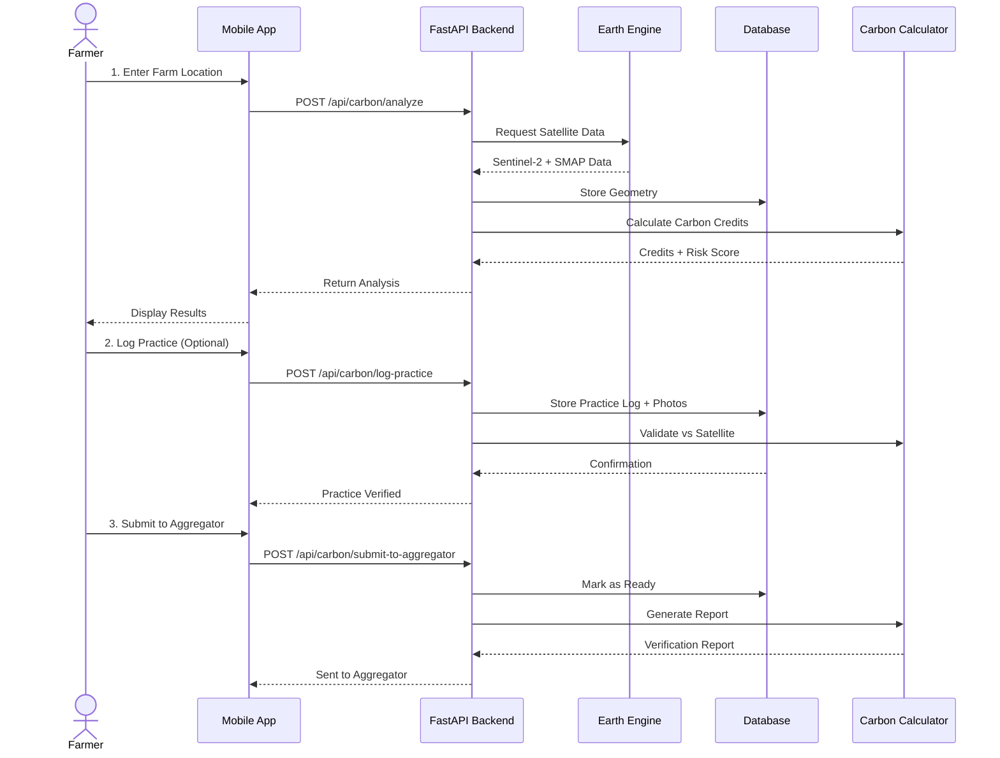

```mermaid
sequenceDiagram
    actor Farmer
    participant App as Mobile App
    participant API as FastAPI Backend
    participant EE as Earth Engine
    participant DB as Database
    participant Calc as Carbon Calculator
    
    Farmer->>App: 1. Enter Farm Location
    App->>API: POST /api/carbon/analyze
    API->>EE: Request Satellite Data
    EE-->>API: Sentinel-2 + SMAP Data
    API->>DB: Store Geometry
    API->>Calc: Calculate Carbon Credits
    Calc-->>API: Credits + Risk Score
    API-->>App: Return Analysis
    App-->>Farmer: Display Results
    
    Farmer->>App: 2. Log Practice (Optional)
    App->>API: POST /api/carbon/log-practice
    API->>DB: Store Practice Log + Photos
    API->>Calc: Validate vs Satellite
    DB-->>API: Confirmation
    API-->>App: Practice Verified
    
    Farmer->>App: 3. Submit to Aggregator
    App->>API: POST /api/carbon/submit-to-aggregator
    API->>DB: Mark as Ready
    API->>Calc: Generate Report
    Calc-->>API: Verification Report
    API-->>App: Sent to Aggregator
```
