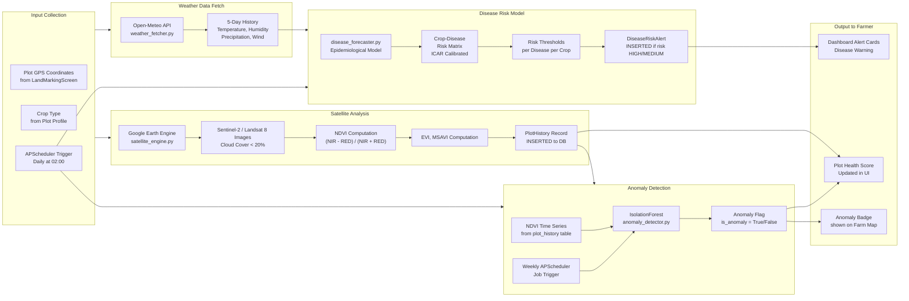

# ML Pipeline and Disease Forecasting Workflow
# Krishi-Drishti - Machine Learning Subsystem
# Used in: Section 5.1.8 and Section 4.1.5 of PROJECT_REPORT_FINAL.txt
# Render at: https://mermaid.live

