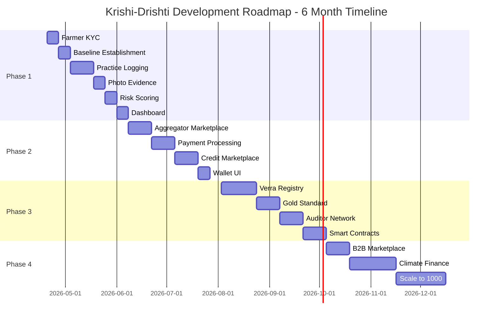

```mermaid
gantt
    title Krishi-Drishti Development Roadmap - 6 Month Timeline
    dateFormat YYYY-MM-DD
    
    section Phase 1
    Farmer KYC :phase1_1, 2026-04-20, 7d
    Baseline Establishment :phase1_2, 2026-04-27, 7d
    Practice Logging :phase1_3, 2026-05-04, 14d
    Photo Evidence :phase1_4, 2026-05-18, 7d
    Risk Scoring :phase1_5, 2026-05-25, 7d
    Dashboard :phase1_6, 2026-06-01, 7d
    
    section Phase 2
    Aggregator Marketplace :phase2_1, 2026-06-08, 14d
    Payment Processing :phase2_2, 2026-06-22, 14d
    Credit Marketplace :phase2_3, 2026-07-06, 14d
    Wallet UI :phase2_4, 2026-07-20, 7d
    
    section Phase 3
    Verra Registry :phase3_1, 2026-08-03, 21d
    Gold Standard :phase3_2, 2026-08-24, 14d
    Auditor Network :phase3_3, 2026-09-07, 14d
    Smart Contracts :phase3_4, 2026-09-21, 14d
    
    section Phase 4
    B2B Marketplace :phase4_1, 2026-10-05, 14d
    Climate Finance :phase4_2, 2026-10-19, 28d
    Scale to 1000 :phase4_3, 2026-11-16, 30d
```
