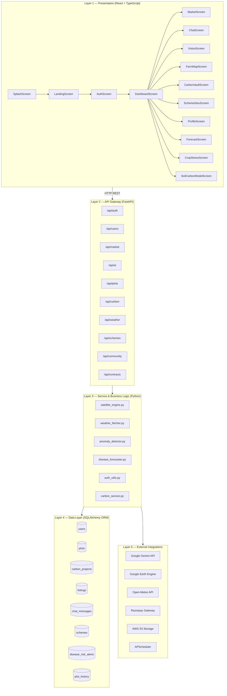

# System Architecture Diagram
# Krishi-Drishti - Five Layer Architecture
# Used in: Section 4.1.1 of PROJECT_REPORT_FINAL.txt
# Render at: https://mermaid.live

```mermaid
graph TB
    subgraph L1["Layer 1 — Presentation (React + TypeScript)"]
        A1[SplashScreen] --> A2[LandingScreen]
        A2 --> A3[AuthScreen]
        A3 --> A4[DashboardScreen]
        A4 --> A5[MarketScreen]
        A4 --> A6[ChatScreen]
        A4 --> A7[VisionScreen]
        A4 --> A8[FarmMapScreen]
        A4 --> A9[CarbonVaultScreen]
        A4 --> A10[SchemeSetuScreen]
        A4 --> A11[ProfileScreen]
        A4 --> A12[ForecastScreen]
        A4 --> A13[CropStressScreen]
        A4 --> A14[SoilCarbonModelScreen]
    end

    subgraph L2["Layer 2 — API Gateway (FastAPI)"]
        B1["/api/auth"] 
        B2["/api/users"]
        B3["/api/market"]
        B4["/api/ai"]
        B5["/api/plots"]
        B6["/api/carbon"]
        B7["/api/weather"]
        B8["/api/schemes"]
        B9["/api/community"]
        B10["/api/contracts"]
    end

    subgraph L3["Layer 3 — Service & Business Logic (Python)"]
        C1[satellite_engine.py]
        C2[weather_fetcher.py]
        C3[anomaly_detector.py]
        C4[disease_forecaster.py]
        C5[auth_utils.py]
        C6[carbon_service.py]
    end

    subgraph L4["Layer 4 — Data Layer (SQLAlchemy ORM)"]
        D1[(users)]
        D2[(plots)]
        D3[(carbon_projects)]
        D4[(listings)]
        D5[(chat_messages)]
        D6[(schemes)]
        D7[(disease_risk_alerts)]
        D8[(plot_history)]
    end

    subgraph L5["Layer 5 — External Integrations"]
        E1[Google Gemini API]
        E2[Google Earth Engine]
        E3[Open-Meteo API]
        E4[Razorpay Gateway]
        E5[AWS S3 Storage]
        E6[APScheduler]
    end

    L1 -->|"HTTP REST"| L2
    L2 --> L3
    L3 --> L4
    L3 --> L5
```
