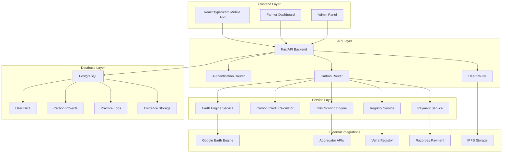

```mermaid
graph TB
    subgraph "Frontend Layer"
        A1["React/TypeScript Mobile App"]
        A2["Farmer Dashboard"]
        A3["Admin Panel"]
    end
    
    subgraph "API Layer"
        B1["FastAPI Backend"]
        B2["Authentication Router"]
        B3["Carbon Router"]
        B4["User Router"]
    end
    
    subgraph "Service Layer"
        C1["Earth Engine Service"]
        C2["Carbon Credit Calculator"]
        C3["Risk Scoring Engine"]
        C4["Payment Service"]
        C5["Registry Service"]
    end
    
    subgraph "External Integrations"
        D1["Google Earth Engine"]
        D2["Aggregator APIs"]
        D3["Verra Registry"]
        D4["Razorpay Payment"]
        D5["IPFS Storage"]
    end
    
    subgraph "Database Layer"
        E1["PostgreSQL"]
        E2["User Data"]
        E3["Carbon Projects"]
        E4["Practice Logs"]
        E5["Evidence Storage"]
    end
    
    A1 --> B1
    A2 --> B1
    A3 --> B1
    
    B1 --> B2
    B1 --> B3
    B1 --> B4
    
    B3 --> C1
    B3 --> C2
    B3 --> C3
    B3 --> C4
    B3 --> C5
    
    C1 --> D1
    C4 --> D4
    C5 --> D3
    C3 --> D2
    B4 --> D5
    
    B1 --> E1
    E1 --> E2
    E1 --> E3
    E1 --> E4
    E1 --> E5
```
