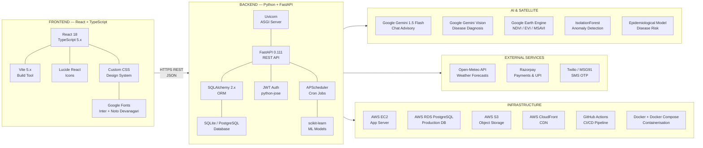

# Technology Stack Diagram
# Krishi-Drishti - Complete Technology Architecture
# Used in: Section 3.2 of PROJECT_REPORT_FINAL.txt
# Render at: https://mermaid.live

```mermaid
graph LR
    subgraph FRONTEND["FRONTEND — React + TypeScript"]
        F1["React 18\nTypeScript 5.x"]
        F2["Vite 5.x\nBuild Tool"]
        F3["Lucide React\nIcons"]
        F4["Custom CSS\nDesign System"]
        F5["Google Fonts\nInter + Noto Devanagari"]
        F1 --- F2
        F1 --- F3
        F1 --- F4
        F4 --- F5
    end

    subgraph BACKEND["BACKEND — Python + FastAPI"]
        B1["FastAPI 0.111\nREST API"]
        B2["SQLAlchemy 2.x\nORM"]
        B3["SQLite / PostgreSQL\nDatabase"]
        B4["JWT Auth\npython-jose"]
        B5["APScheduler\nCron Jobs"]
        B6["scikit-learn\nML Models"]
        B7["Uvicorn\nASGI Server"]
        B1 --- B2
        B2 --- B3
        B1 --- B4
        B1 --- B5
        B5 --- B6
        B7 --- B1
    end

    subgraph AI["AI & SATELLITE"]
        AI1["Google Gemini 1.5 Flash\nChat Advisory"]
        AI2["Google Gemini Vision\nDisease Diagnosis"]
        AI3["Google Earth Engine\nNDVI / EVI / MSAVI"]
        AI4["IsolationForest\nAnomaly Detection"]
        AI5["Epidemiological Model\nDisease Risk"]
    end

    subgraph INFRA["INFRASTRUCTURE"]
        I1["AWS EC2\nApp Server"]
        I2["AWS RDS PostgreSQL\nProduction DB"]
        I3["AWS S3\nObject Storage"]
        I4["AWS CloudFront\nCDN"]
        I5["GitHub Actions\nCI/CD Pipeline"]
        I6["Docker + Docker Compose\nContainerisation"]
    end

    subgraph EXTERNAL["EXTERNAL SERVICES"]
        E1["Open-Meteo API\nWeather Forecasts"]
        E2["Razorpay\nPayments & UPI"]
        E3["Twilio / MSG91\nSMS OTP"]
    end

    FRONTEND -->|"HTTPS REST\nJSON"| BACKEND
    BACKEND --> AI
    BACKEND --> EXTERNAL
    BACKEND --> INFRA
```
