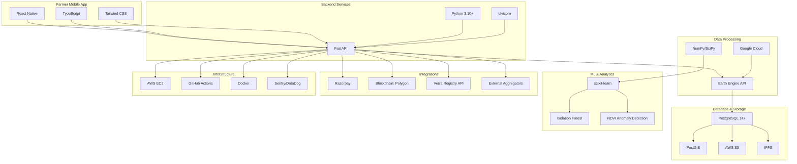

```mermaid
graph TB
    subgraph "Farmer Mobile App"
        A1["React Native"]
        A2["TypeScript"]
        A3["Tailwind CSS"]
    end
    
    subgraph "Backend Services"
        B1["FastAPI"]
        B2["Python 3.10+"]
        B3["Uvicorn"]
    end
    
    subgraph "Data Processing"
        C1["Earth Engine API"]
        C2["Google Cloud"]
        C3["NumPy/SciPy"]
    end
    
    subgraph "Database & Storage"
        D1["PostgreSQL 14+"]
        D2["PostGIS"]
        D3["AWS S3"]
        D4["IPFS"]
    end
    
    subgraph "ML & Analytics"
        E1["scikit-learn"]
        E2["Isolation Forest"]
        E3["NDVI Anomaly Detection"]
    end
    
    subgraph "Integrations"
        F1["Razorpay"]
        F2["Blockchain: Polygon"]
        F3["Verra Registry API"]
        F4["External Aggregators"]
    end
    
    subgraph "Infrastructure"
        G1["AWS EC2"]
        G2["GitHub Actions"]
        G3["Docker"]
        G4["Sentry/DataDog"]
    end
    
    A1 --> B1
    A2 --> B1
    A3 --> B1
    
    B1 --> C1
    B2 --> B1
    B3 --> B1
    
    C1 --> D1
    C2 --> C1
    C3 --> E1
    
    D1 --> D2
    D1 --> D3
    D1 --> D4
    
    E1 --> E2
    E1 --> E3
    
    B1 --> F1
    B1 --> F2
    B1 --> F3
    B1 --> F4
    
    B1 --> G1
    B1 --> G2
    B1 --> G3
    B1 --> G4
```
