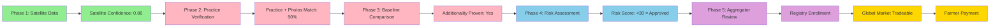

```mermaid
graph LR
    A["Phase 1: Satellite Data"] --> B["Satellite Confidence: 0.86"]
    B --> C["Phase 2: Practice Verification"]
    C --> D["Practice + Photos Match: 90%"]
    D --> E["Phase 3: Baseline Comparison"]
    E --> F["Additionality Proven: Yes"]
    F --> G["Phase 4: Risk Assessment"]
    G --> H["Risk Score: <30 = Approved"]
    H --> I["Phase 5: Aggregator Review"]
    I --> J["Registry Enrollment"]
    J --> K["Global Market Tradeable"]
    K --> L["Farmer Payment"]
    
    style A fill:#90EE90
    style B fill:#90EE90
    style C fill:#FFB6C1
    style D fill:#FFB6C1
    style E fill:#FFB6C1
    style F fill:#FFB6C1
    style G fill:#87CEEB
    style H fill:#87CEEB
    style I fill:#DDA0DD
    style J fill:#DDA0DD
    style K fill:#FFD700
    style L fill:#FFD700
```
