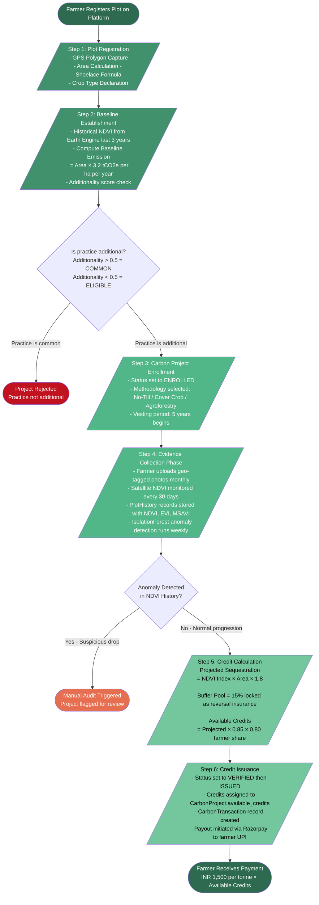

# Carbon Credit Verification Pipeline
# Krishi-Drishti - 5-Layer Verification Process
# Used in: Section 4.1.4 (Carbon Credit Methodology) of PROJECT_REPORT_FINAL.txt
# Render at: https://mermaid.live

